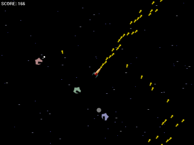
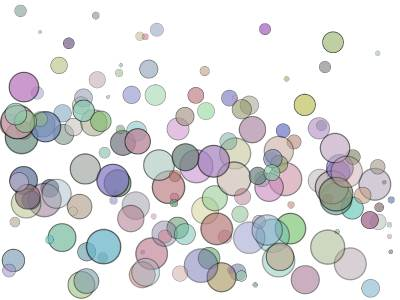
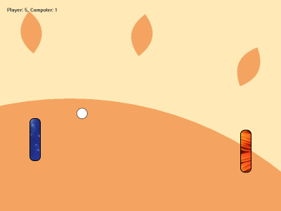

# erlworld

Concurrent game framework for Erlang

A simple framework written in Erlang for building concurrent 2D games. Uses an object-oriented design for structuring your game as lots of processes running simultanously. This was built as a third year project at the https://cs.kent.ac.uk/[University of Kent].

## Features

Allows your game to automatically be updated in parallel.
Uses OpenGL for hardware accelerated graphics.
whilst also using a pipelining structure so drawing happens at the same time as updating.
Uses hardware accelerated graphics using OpenGL and the Erlang WX bindings.

## Install

WRITEME

## Examples

Currently three simple examples built using the framework which you can find in the downloads section. All games include source code.

### Blastox

An asteroids clone showing that the framework can handle a complete (although small) game. Press space to shoot and use the arrow keys to control the player. The aim is to stay alive are asteroids fade into space which you must destroy to gain points.

To play call `blastox:start()`.

### Circles

Starts out empty, but click to add circles. They fly out according to the direction your moving will bounce around the world.

To play call `circles:start()`.

### Pong

It's not a game engine if it doesn't have a Pong clone. You play on the left, computer on the right.

To play call `pong:start()`.

Project Information

License: New BSD License
